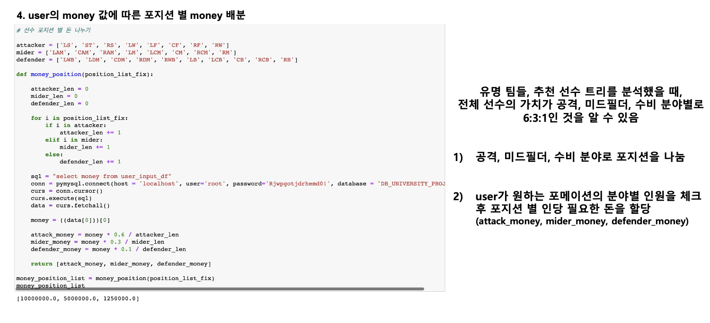

# 1. Introduction & Abstraction
2021년 데이터베이스 과목 팀프로젝트  
FIFA21 게임 이용자 성향을 반영한 선수 추천시스템

## 연구 배경 및 동기
1. 높은 진입장벽으로 인한 초보 플레이어(유입)의 어려움
  

2. 추천 시스템의 부재  

## 연구 목적
1. FIFA21의 진입장벽을 해소하여 초보 유저들이 쉽게 게임에 적응할 수 있게 함.
2. FIFA21 게임의 능력치 도출 공식을 활용하여 사용자가 제시한 조건에 맞는 최선의 선수를 추천해주어 높은 성능으로 게임을 진행할 수 있게 함.
3. 유저 개개인의 성향에 맞춘 Squad를 추천하여, 더 높은 만족감을 얻게 함.  
  

      
# 2. Project Design

## ER Diagram 
총 3개의 테이블로 구성.  
선수정보 테이블은 Kaggle에서 얻은 FIFA21 게임 내 데이터  
Formation 테이블은 포메이션에 맞게 포지션이 적힌 데이터  
User 테이블은 임의로 해당 프로젝트를 사용하는 User의 정보를 가정한 데이터이다.  

## 포메이션과 포지션으로만 우선적으로 필터링을 한 근거  
 . 
  

      
# 3. Experiment & Setting
## data table   
 . 
 . 
 . 
## join table 
 . 
  
## 후보 테이블 생성  
 . 
 . 

## Experiment 
 . 
 . 

  

# 4. Result 
 . 

# 5. User Opinion
 .   

# 6. Conclusion & Limitations 
## Conclusion
1. 신규 유저 유입으로 인한 매출 향상
2. 유저들의 만족도로 인한 게임 가치 향상  
등에 도움을 줄 수 있다.

## Limitations
1. 선수 추천에 대한 알고리즘이 프로젝트 구성 때와 달리 생각보다 복잡해서 선수들의 최종 가치 평가를 위한 수식의 정밀도를 낮게 구성할 수 밖에 없었다.
2. 유저가 보유한 금액이 매우 높을 시 특정 선수만이 추천될 수 있는 Bias가 있다.
